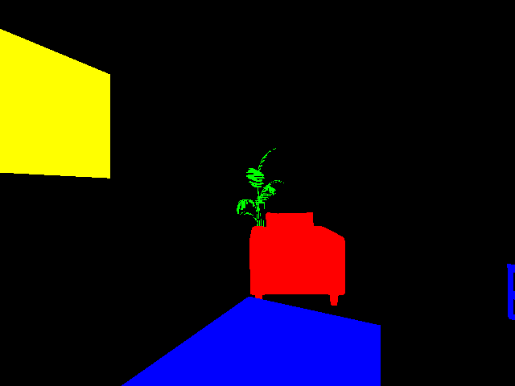

# Semantic Segmentation

This is a small project dìon semantic segmentation using a synthetic dataset obtained from Unreal Engine.
The task is to create a synthetic dataset from Unreal Engine using the plugin [Unrealcv](https://unrealcv.org).
The dataset is composed by RGBD (RGB + depth) images and ground truth. The environment is a simple room with some couches, two TVs, two plants and some tables.
Once collected the dataset it is possible to detect and localize objects in images.
This can be done using a semantic segmentation network. Semantic segmentation networks basically perform pixel-wise classification assigning for each pixel its class.

# Description of the repository
Inside semantic-seg the main files are:
- generate_dataset.py : Script for generating dataset interacting with the unrealcv server.
- write_dataset_to_tf.py : Read the dataset written previously and store in tfrecord files.
- train.py : network training using a modified version of the [Semantic-Segmentation-Suite](https://github.com/GeorgeSeif/Semantic-Segmentation-Suite)

# Installation

Clone the repo and install requirements:
```
git clone https://github.com/EmanueleGhelfi/semantic-seg/
cd semantic-seg
conda create -n semantic-seg
pip install -r requirements.txt
```

# Run

## Step 0: Environment

### Using the predefined environment
Download the Unreal enviroment from [here](https://drive.google.com/open?id=1stYziULUXthkDaK0Bi0A6474u_hc_Lip).
Open the project with unreal.

### Using a new environment
install the plugin [Unrealcv](https://unrealcv.org) following the instructions. Start a new project and import the desired objects.

## Step 1: Dataset generation
Start the environment defined in the Step 0. Configure the `generate_dataset.py` script in order to connect to the correct port. To check the unrealcv port type the following command in the unreal console while the environment is running:
```
vget /unrealcv/status
```
Check if the server is listening, check the unreal port and that no client is connected.

By default unrealcv generates a different label (color) for each object in the scene based on its id. Object detection is the task of recognizing the object class, not the object instance. The file conf.json defines the class for each object of interest in the scene, based on its id. When the script starts it configures unrealcv by setting the defined color for each object and setting all other object's color to black.

Launch:
```
python generate_dataset.py
```
This should save the rgb images, the depth images and associated labels inside the folder `dataset`. The script moves randomly the camera inside a predefined range and takes photos. A check is added in order to not take empty photos.

Example of obtained image with the corresponding label:

| Image             |  Label |
:-------------------------:|:-------------------------:
  |  

## Step 2: Tfrecord conversion

Convert the generated dataset to tfrecord files.
```
python write_dataset_to_tf.py
```
This should save the training, validation and test sets inside dataset/tfrecord/. Images are saved in RGBD format. Labels are saved in color index format. For each pixel there is a unique label depending on the object. In this way once imported in tensorflow it is enough to transform the label using `tf.one_hot`.

## Step 3: Training

Train the selected semantic segmentation network:
```
python train.py
```
The training is implemented using the tf.data API.

